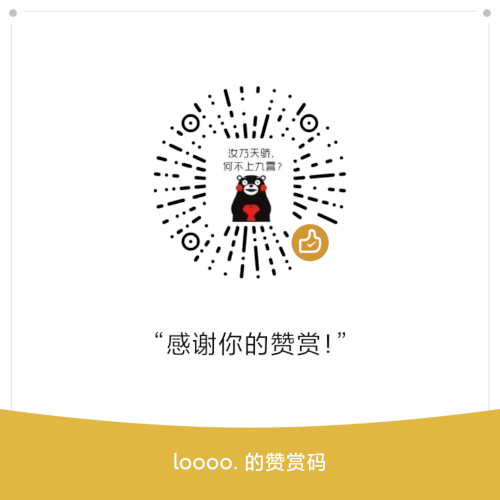

---

title: 赞助
date: 2022-8-15

---

## 前言

    DragonOS是一个不收费的开源项目，但是其日常维护仍需要一些资金，如果你愿意的话，可以通过以下页面，赞助DragonOS，这样也能促进这个项目的发展。所有的赞助者的名单都会被公示。

## 赞助的资金都会被用到哪里？

- 为活跃的社区开发者发放补贴或设备支持
- DragonOS的云服务开支
- 设备购置
- 任何有助于DragonOS发展的用途

## 赞助方式

### 小额赞助

    对于小额的，不超过人民币200元赞助，您可以扫描以下二维码进行赞助。请您在付款备注处注明：DragonOS-<您的GitHub ID>

#### 通过微信赞助

#### 通过数字人民币赞助

    DragonOS的数字人民币收款钱包编号为：**0071210804042553**

### 大额赞助/设备赞助/合作

    请通过邮件联系龙进：[longjin@RinGoTek.cn](mailto:longjin@RinGoTek.cn)
